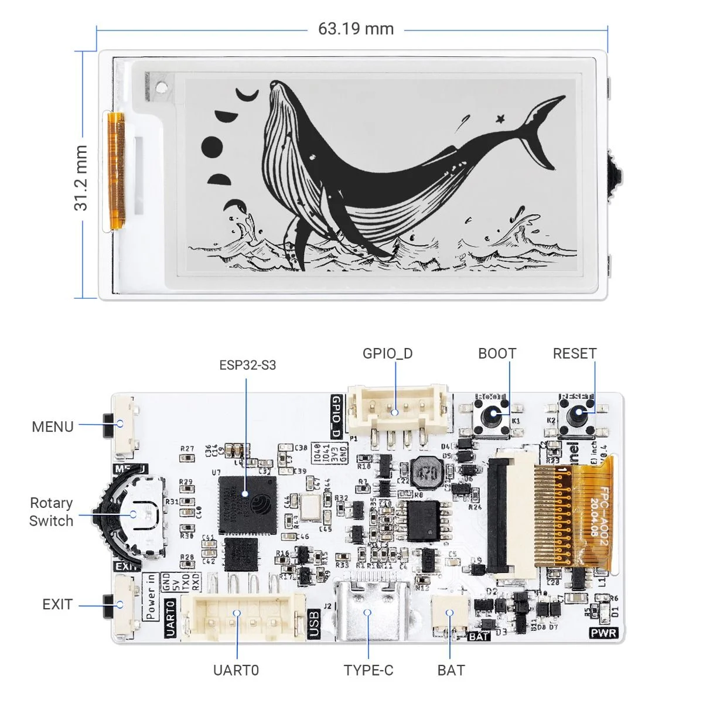
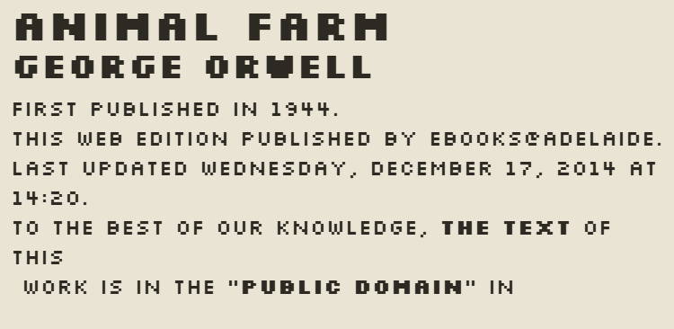
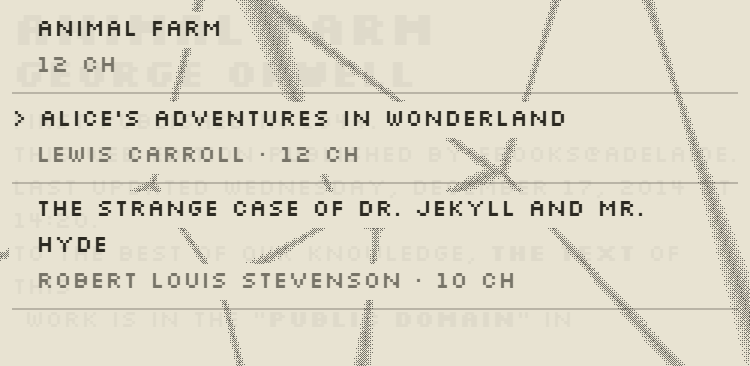
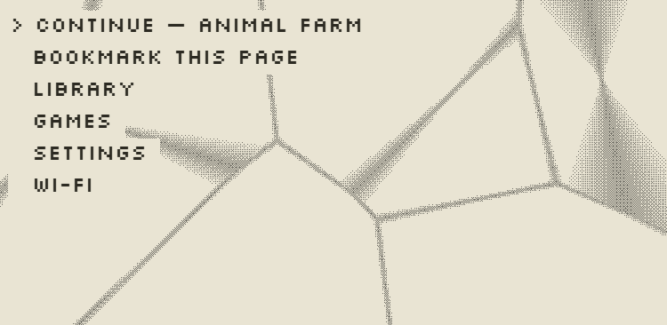
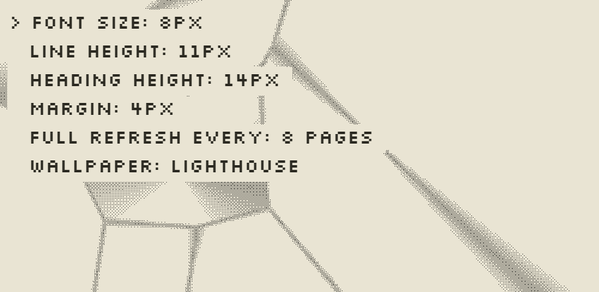

# esp32-epaper-ereader

> 🤖 **Disclosure: this project is "vibe coded."** The firmware, converter, simulator, docs, and
> this README were written collaboratively with [Claude](https://claude.com/claude-code) (Anthropic),
> directed and reviewed by a human, without physical access to the target hardware. Nothing here has
> run on a real board yet — see [Status / what needs real-hardware verification](#status--what-needs-real-hardware-verification)
> for the specific things that are reasoned-through rather than measured. Treat pin mappings, driver
> compatibility, and size estimates as a well-researched starting point to verify, not a guarantee.

A DIY EPUB e-reader built on the [CrowPanel ESP32 2.13" E-Paper HMI Display](https://www.elecrow.com/crowpanel-esp32-2-13-e-paper-hmi-display-with-122-250-resolution-black-white-color-driven-by-spi-interface.html)
(ESP32-S3, SSD1680Z/JD79661, 122×250 mono, 8MB flash, no SD slot) — full firmware, a browser-side
EPUB converter, a parametric enclosure, and a **fully-interactive browser simulator** so you can
build and preview the whole reading experience before your hardware even ships.

Not aiming for EPUB spec compliance — CSS, embedded fonts, images, and complex layout are
intentionally dropped. The goal is fast, low-effort page turns on very limited hardware, and a
project you can actually finish.

## The hardware



<sub>Product image © [Elecrow](https://www.elecrow.com/crowpanel-esp32-2-13-e-paper-hmi-display-with-122-250-resolution-black-white-color-driven-by-spi-interface.html) — not a photo of this build. Real photos of the assembled reader are in [Coming soon](#coming-soon).</sub>

Two things on that board shape most of this project:

- **The 63.19 × 31.2 mm active area.** That's tiny — about 38 characters per line at the font size
  this uses, and only ~19 if you turned it portrait, which is why the UI is landscape-only. It's
  also the exact figure the simulator's [true-size calibration](docs/SIMULATOR.md#true-size-calibration)
  renders against, so the preview matches the real panel rather than just looking plausible.
- **Three inputs: MENU, EXIT, and a rotary switch** (which has its own push-click, giving six
  gestures once you count short vs. long presses). Every screen in the reader — menus, settings,
  all five games — is built to be driven by just those.

Note the `BAT` connector is a power input only: the schematic has no battery-voltage sense line to
the MCU, which is why there's no battery indicator anywhere in the UI. See
[docs/SIMULATOR.md](docs/SIMULATOR.md#deliberately-not-simulated-battery-percentage) for the
two-resistor fix if you want one.

## Try it without any hardware

The `simulator/` folder is a self-contained, single-file browser app that mimics the real device —
same pagination logic as the converter, the same rotary/MENU/EXIT input model, and an accurate
e-ink partial-refresh/ghosting simulation — so you can load a real EPUB and see exactly how it will
look and behave on the panel.

```bash
cd simulator
python -m http.server 8420
# open http://localhost:8420
```

**[Live demo →](https://trimpta.com/esp32-epaper-ereader/)** *(deploys automatically from `simulator/` via GitHub Actions)*

| Reading | Library | Menu |
|---|---|---|
|  |  |  |

| Settings | Hangman | Sleep wallpaper |
|---|---|---|
|  |  |  |

### What the simulator covers

- **Real pagination** — the exact tag-stripping/line-wrap/paginate logic the converter uses,
  rendered against the same font metrics the firmware will draw with.
- **Accurate e-ink behavior** — partial-refresh ghosting accumulation, periodic full-refresh
  flash sequences, and a long-press-MENU "force full refresh" — the same visual quirks a real
  EPD panel has, not a clean LCD redraw.
- **The real input model** — rotary scroll to move, short/long click on MENU, EXIT, and the
  rotary dial itself (six distinct gestures total, matching the schematic's actual GPIOs), mapped
  to mouse/touch so it works on desktop and mobile.
- **A two-layer menu** — MENU opens the current book's own menu (chapters, bookmarks, resume);
  EXIT opens the general home menu (library, settings, Wi-Fi, games) — so jumping chapters while
  reading doesn't require backing all the way out.
- **Scrub-to-edit numeric settings** — long-press the rotary to enter edit mode and dial a value
  in directly, or just keep tapping +1/-1 like before.
- **Five built-in games** — Lights Out, Minesweeper, Sudoku, Tic-Tac-Toe (real minimax AI), and
  Hangman, all built on the same rotary-cursor/MENU-select input pattern as the reader itself.
- **A wallpaper system** — pick from built-in wallpapers or upload your own from the web panel,
  with fit (cover/contain/stretch), pan, brightness, contrast, and invert controls on a live
  preview before it's committed; dithering to the panel's real 1-bit palette happens client-side,
  and only the ~3.7KB dithered bitmap is ever treated as what "reaches the device."
- **Per-book reading stats** — progress, pages read today, average pages/day, an estimated
  days-to-finish, and cumulative time spent reading, computed from a small per-day log rather than
  invented numbers.
- **A live memory panel** — real `.cebk`-equivalent byte accounting against the actual
  `firmware/partitions.csv` budget, not a placeholder estimate.
- **True-size calibration** — a ruler overlay with an adjustable slider so you can match the
  on-screen size to a real ruler and get an honest preview of the panel's actual footprint.

See [docs/SIMULATOR.md](docs/SIMULATOR.md) for the full UI/UX reference (input mapping, screen
hierarchy, every simulator-only affordance and how it maps — or doesn't — to real firmware).

## How the reader itself works

```
   EPUB file                  browser (converter/)                ESP32 (firmware/)
 ┌───────────┐   unzip/parse   ┌──────────────────────┐   POST    ┌───────────────────┐
 │  book.epub│ ──────────────▶ │ strip tags, keep      │ /upload  │  LittleFS: *.cebk  │
 └───────────┘                 │ b/i/h1/h2, precompute │ ───────▶ │  renderer: seek +  │
                                │ line + page breaks    │          │  draw, no layout   │
                                │ against real font     │          │  work on device     │
                                │ metrics → .cebk file  │          └───────────────────┘
                                └──────────────────────┘
```

All the expensive work (unzipping, XML parsing, line-wrapping, pagination) happens once, in the
browser, using the same font metrics the device renders with. The ESP32 never parses EPUB/XML —
it just seeks into a flat binary and blits precomputed lines. See [docs/FORMAT.md](docs/FORMAT.md)
for the exact layout and [docs/ARCHITECTURE.md](docs/ARCHITECTURE.md) for the full pipeline and
the reasoning behind the design choices (transport, refresh strategy, storage constraints).

## Repo layout

- `simulator/` — standalone browser preview of the on-device reading UI (no hardware needed): same
  tag-stripping/wrap/paginate logic as the converter, rotary→scroll and MENU/EXIT→LMB/RMB input
  mapping, live layout-parameter sliders, games, wallpapers, and a memory/calibration panel.
  `simulator/docs.html` is a separate in-site page rendering the four docs below in full, with an
  index to switch between them — simulator-only, not part of what the ESP32 itself ever serves.
- `converter/` — browser-side EPUB → `.cebk` converter (JSZip + vanilla JS). Runs standalone or
  loaded from the page the device itself serves.
- `docs/FORMAT.md` — the `.cebk` binary format spec (must stay in sync between converter and firmware).
- `docs/ARCHITECTURE.md` — pipeline, transport, refresh/pagination strategy, known open questions.
- `docs/FLASH_BUDGET.md` — verified flash/RAM accounting: what fits, what doesn't need porting,
  and roughly how many books fit once firmware and wallpapers are accounted for.
- `docs/SIMULATOR.md` — full UI/UX reference for the simulator (input mapping, screen hierarchy,
  every feature and how it relates to real hardware).
- `docs/FIRMWARE_REVIEW.md` — what a full firmware review + real compile found, and where the
  device and the simulator now match feature for feature.
- `docs/HARDWARE_DIVERGENCES.md` — everywhere the browser preview deliberately differs from the
  physical panel, and what each difference costs.
- `docs/ABOUT.md` — what this project is, the AI-assistance disclosure, sources and inspirations.
- `firmware/` — PlatformIO/Arduino project for the ESP32-S3: WiFi provisioning, upload server,
  book storage, e-paper renderer, button/rotary input, `partitions.csv`.
- `tools/dump_font_metrics/` — one-time Arduino sketch that dumps the *actual* on-device glyph
  widths over Serial, so the browser converter paginates using real metrics instead of guesses.
- `enclosure/` — parametric OpenSCAD case with button cutouts and a battery bay.

## Status / what needs real-hardware verification

This was built without physical access to the board, so a few things are marked `TODO(verify)` in
code and need confirming against the actual PCB before they'll work:

- Exact SPI pin mapping for the display (CS/DC/RST/BUSY) — not published in Elecrow's docs, only
  the button/rotary GPIOs were (`firmware/src/config.h` has those).
- Whether [GxEPD2](https://github.com/ZinggJM/GxEPD2) supports the JD79661 driver variant, or
  whether Elecrow's own EPD library has to be used instead. Every GxEPD2 call is confined to
  `firmware/src/renderer.cpp` — menus and games draw through `Renderer`, never the display object
  — so swapping the backend stays a one-file change.
- Real glyph widths from `tools/dump_font_metrics` — `converter/font-metrics.example.json` is a
  placeholder and pagination will drift from what's actually rendered until replaced.
- Whether the `ext1` wake pin set is valid on this board, which is what gates real power saving
  between page turns (`firmware/src/input.h`).

The firmware itself now **compiles** against ESP32 Arduino core 3.3.10 — that build is what
caught the display-init bug and several others; see
[docs/FIRMWARE_REVIEW.md](docs/FIRMWARE_REVIEW.md). It still hasn't run on a board.

## Sources & inspirations

- **Hardware:** [Elecrow CrowPanel ESP32 2.13" E-Paper HMI Display](https://www.elecrow.com/crowpanel-esp32-2-13-e-paper-hmi-display-with-122-250-resolution-black-white-color-driven-by-spi-interface.html).
  The annotated board image in [The hardware](#the-hardware) is Elecrow's own product image,
  reproduced here for reference; their published schematic is also where the GPIO assignments in
  `firmware/src/config.h` come from.
- **Precedent projects** (see [docs/ARCHITECTURE.md](docs/ARCHITECTURE.md) for how this one differs):
  [atomic14/diy-esp32-epub-reader](https://github.com/atomic14/diy-esp32-epub-reader) does
  equivalent tag-stripping on-device; [Soldered's Inkplate 6FLICK](https://soldered.com/product/soldered-inkplate-6flick-e-paper-board/)
  pre-converts EPUBs with a host-side Python script before they reach the device — this project
  follows that second pattern, but in the browser and with pagination also moved off-device.
- **Firmware libraries:** [GxEPD2](https://github.com/ZinggJM/GxEPD2),
  [U8g2_for_Adafruit_GFX](https://github.com/olikraus/U8g2_for_Adafruit_GFX),
  [Adafruit GFX Library](https://github.com/adafruit/Adafruit-GFX-Library),
  [WiFiManager](https://github.com/tzapu/WiFiManager),
  [ESPAsyncWebServer](https://github.com/esphome/ESPAsyncWebServer) /
  [AsyncTCP](https://github.com/esphome/AsyncTCP) (esphome forks), [ArduinoJson](https://arduinojson.org/).
- **Converter:** [JSZip](https://stuk.github.io/jszip/) for standalone EPUB unzipping outside the simulator.
- **Fonts:** [Silkscreen](https://fonts.google.com/specimen/Silkscreen), [IBM Plex Mono, and IBM Plex Sans](https://fonts.google.com/specimen/IBM+Plex+Sans) (Google Fonts).
- **Sample books:** *Alice's Adventures in Wonderland*, *The Strange Case of Dr. Jekyll and Mr.
  Hyde*, and *The Wonderful Wizard of Oz* — all genuinely US-public-domain texts via
  [Project Gutenberg](https://www.gutenberg.org/), used as real conversion-pipeline test input
  rather than placeholder text.

## Coming soon

Real hardware photos, an unboxing/assembly walkthrough, and side-by-side simulator-vs-actual-panel
comparison shots will go here once the board arrives and the `TODO(verify)` items above get closed
out against it.

## Building one yourself

1. Order the [CrowPanel ESP32 2.13" E-Paper HMI Display](https://www.elecrow.com/crowpanel-esp32-2-13-e-paper-hmi-display-with-122-250-resolution-black-white-color-driven-by-spi-interface.html).
2. While it's in transit, poke around the [simulator](#try-it-without-any-hardware) — load your
   own EPUB, try the games, pick a wallpaper, get a feel for the actual reading experience.
3. Skim [docs/ARCHITECTURE.md](docs/ARCHITECTURE.md) and [docs/FORMAT.md](docs/FORMAT.md) to
   understand the conversion pipeline, then [docs/FLASH_BUDGET.md](docs/FLASH_BUDGET.md) for what
   fits on the device.
4. Flash `firmware/` with PlatformIO once your board is in hand (see `TODO(verify)` notes above —
   pin mapping and the EPD driver variant need confirming against your specific unit first).
5. Print or laser-cut `enclosure/case.scad`.

Issues and PRs welcome, especially real-hardware findings that close out the `TODO(verify)` items.
